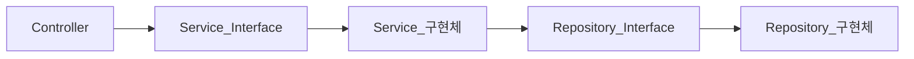

## 인프런 워밍업 클럽 미니 프로젝트 개별 폴더

### 단계별 요구사항

<details>
<summary>프로젝트 1단계</summary>

#### 요구사항

- 프로젝트 최소 설정이 이루어져야 합니다.
- 팀 등록 기능
  - 회사에 있는 팀을 등록할 수 있어야 합니다. 팀이 가져야할 필수 정보는 다음과 같습니다.
  - `팀 이름`
- 직원 등록 기능
  - 직원을 등록할 수 있어야 합니다. 직원이 가져야할 필수 정보는 다음과 같습니다.
  - `직원 이름`
  - `팀의 매니저인지 매니저가 아닌지 여부`
  - `회사에 들어온 일자`
  - `생일`
- 팀 조회 기능
  - 모든 팀의 정보를 한 번에 조회할 수 있어야 합니다.

```json
{
  "result": [
    {
      "name": "팀 이름",
      "manager": "팀 매니저 이름",
      "memberCount": "팀 인원 수"
    }
  ]
}
```

- 직원 조회 기능

```json
{
  "result": [
    {
      "name": "직원 이름",
      "teamName": "소속 팀 이름",
      "role": "MANAGER or MEMBER",
      "birthday": "1999-09-09",
      "workStartDate": "2024-02-29"
    }
  ]
}
```

</details>

### 풀이

<details>
<summary>프로젝트 1단계</summary>


#### 중점 구현 사항

- 팀 등록 기능
- 팀 조회 기능
- 직원 등록 기능
- 직원 조회 기능
- 직업 룰(Manager, Member) 업데이트 기능
- 최대한 요구사항을 충족시키면서 `TDD` 로 구현
- `Controller Layer` 에 대해 `MockMvc` 를 활용, `Layer Level` 테스트 작성
- 각 기능에 대한 `Integration Test` 작성
- 각 기능에 대한 `Unit Test` 작성

#### 요청 값 검증

- `@Valid` 를 사용하여 요청값 검증

```java
public record MemberRegistrationRequest(
        @NotBlank(message = "이름은 필수 입력값 입니다.")
        String name,

        String teamName,

        @NotNull(message = "생일은 필수 입력값 입니다.")
        @JsonFormat(shape = JsonFormat.Shape.STRING, pattern = "yyyy-MM-dd", timezone = "Asia/Seoul")
        LocalDate birthday,

        @NotNull(message = "근무 시작일은 필수 입력값 입니다.")
        @JsonFormat(shape = JsonFormat.Shape.STRING, pattern = "yyyy-MM-dd", timezone = "Asia/Seoul")
        LocalDate workStartDate
) {
    // ...
}
```

#### 도메인 객체와 `Entity` 객체 분리

- `database` 연결을 위한 `entity` 객체와 도메인 로직을 담당하는 도메인 객체를 분리하여 관리
- 장점: 도메인 객체를 `POJO(Plain Old Java Object)` 로 관리 가능하다.
- 단점: JPA ORM 의 특정 기술(변경감지 등)을 사용할 수 없다.

```java
public record Member(Long id, String name, String teamName, Role role, LocalDate birthday,
                     LocalDate workStartDate) {

    // ...

    public Member updateRole() {
        if (this.role.equals(Role.MANAGER)) {
            return new Member(id, name, teamName, Role.MEMBER, birthday, workStartDate);
        }
        return new Member(id, name, teamName, Role.MANAGER, birthday, workStartDate);
    }

    public boolean isDuplicateMember(Member member) {
        return this.name.equals(member.name()) &&
                this.birthday.equals(member.birthday()) &&
                this.workStartDate.equals(member.workStartDate());
    }

    public boolean isTeamMember(String teamName) {
        return this.teamName.equals(teamName);
    }

    public boolean isTeamManager() {
        return this.role.equals(Role.MANAGER);
    }
}
```

- `Member` 도메인 객체
- 검증 또는 업데이트 등 도메인 로직 존재

```java
@Entity
@Table(name = "members")
public class MemberEntity {

    @Id
    @GeneratedValue(strategy = GenerationType.IDENTITY)
    private Long id;

    private String name;
    private String teamName;

    @Enumerated(EnumType.STRING)
    private Role role;

    private LocalDate birthday;
    private LocalDate workStartDate;

    protected MemberEntity() {
    }

    // model to entity or entity to model 처리 로직
}
```

- `Member entity` 객체
- `model to entity` 또는 `entity to model` 변환 로직만 존재
- 업데이트 또는 검증 로직은 `entity` 객체에 없다.

#### 계층간 추상화

- 계층간 추상화 진행
- 의존관계 역전 원칙(DIP)
- 구현체를 의존하지 않고 인터페이스를 의존하도록 설계
- 장점: 구현체를 갈아 끼우기 매우 편리하다.
- 단점: 작업 공수가 많이 들어가고, 설계가 복잡해진다.


- 의존성 플로우 차트

#### TDD

- 테스트 주도 개발 방식 적용

#### 테스트 코드 작성

- `Rest Assured` 를 사용헤, `API` 요청 및 통합 테스트 작성
- `Fake` 를 활용해, `Service` 로직 테스트 작성
- `MockMvc` 를 활용해, `Controller Layer` 테스트 작성

#### API

```http request
### 맴버 조회 API
GET http://localhost:8080/api/v1/member

### 맴버 등록 API
POST http://localhost:8080/api/v1/member
Content-Type: application/json

{
  "name": "테스트팀원1",
  "teamName": "테스트1팀",
  "birthday": "1999-09-09",
  "workStartDate": "2024-02-29"
}

### 맴버 수정 API
PUT http://localhost:8080/api/v1/member
Content-Type: application/json

{
  "name": "테스트팀원1",
  "teamName": "테스트1팀",
  "birthday": "1999-09-09",
  "workStartDate": "2024-02-29"
}

### 팀 조회 API
GET http://localhost:8080/api/v1/team

### 팀 등록 API
POST http://localhost:8080/api/v1/team
Content-Type: application/json

{
  "name": "테스트1팀"
}
```

</details>


